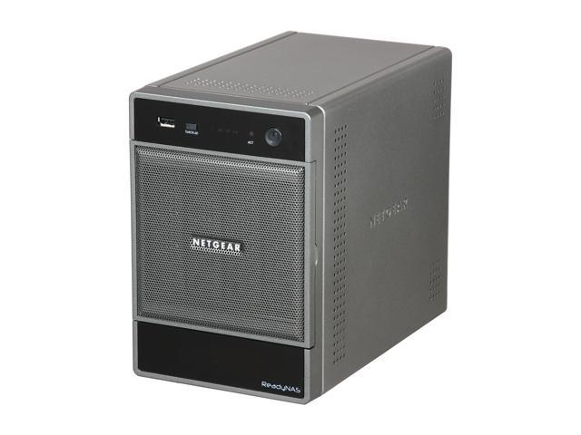

# rndu4000, a linux kernel module to control lcd, leds and buttons of Netgear Readynas Ultra 4.

I have installed a fresh new debian on my Netgear Ready Nas Ultra 4 and the lcd panel keep lighting so i decided to rewrite the kernel module to control lcd, buttons and leds.
Before you try it, i **STRONGLY** encourage you to unmount your raid. It work well on my nas, but well we never know.

Please note that i have nothing to do with Netgear.


# Requirements




 Check your nas

```bash
root@nas:~# dmidecode --type 1
# dmidecode 3.3
Getting SMBIOS data from sysfs.
SMBIOS 2.6 present.

Handle 0x0001, DMI type 1, 27 bytes
System Information
    Manufacturer: NETGEAR
    Product Name: ReadyNAS
    Version: 05/19/2010 ReadyNAS-NVX-V2 V1.8
    Serial Number:
    Wake-up Type: Power Switch
    SKU Number:
    Family
```

```bash
root@nas:~# lspci -d 0x8086:0x2918
00:1f.0 ISA bridge: Intel Corporation 82801IB (ICH9) LPC Interface Controller (rev 02)
```


```bash
root@nas:~# cat /proc/cpuinfo
processor       : 0
vendor_id       : GenuineIntel
cpu family      : 6
model           : 28
model name      : Intel(R) Atom(TM) CPU D410   @ 1.66GHz
```

# Build

```bash
meson setup build
cd build
meson compile
```
or

```bash
cd src
make
```

# Leds

Each led can be constrolled by the following sysfs files :

|  File                                 | Description              |
|---------------------------------------|--------------------------|
| /sys/devices/rndu4000/leds/backup     | Led of the backup button |
| /sys/devices/rndu4000/leds/power      | Led of power button      |
| /sys/devices/rndu4000/leds/disk1      | Led of disk 1            |
| /sys/devices/rndu4000/leds/disk2      | Led of disk 2            |
| /sys/devices/rndu4000/leds/disk3      | Led of disk 3            |
| /sys/devices/rndu4000/leds/disk4      | Led of disk 4            |


Acceptable values are :

## Leds values

| Value | Description |
|-------|-------------|
|   0   |   off       |
|   1   |   on        |
|   2   |   blink     |


## Example

```bash
root@nas:~# echo 2 > /sys/devices/rndu4000/leds/backup
root@nas:~# cat /sys/devices/rndu4000/leds/backup
2
root@nas:~#
```


# Lcd

Lcd panel is 16x2 characters.

|  File                                     | Description                            |
|-------------------------------------------|----------------------------------------|
| /sys/devices/rndu4000/lcd/backlight       | Enable/Disable Backlight of lcd panel  |
| /dev/lcd                                  | Character device to write text on lcd  |


## Escape commands

|  Command   | Description                     |
|------------|---------------------------------|
| \e[2J      | Clear the screen, return to home|
| \e[H       | Set cursor position to 0,0      |
| \e[LC      | Set cursor visible              |
| \e[Lc      | Set cursor invisible            |
| \e[LB      | Enable cursor blink             |
| \e[Lb      | Disable cursor blink            |
| \e[L+      | Enable backlight                |
| \e[L-      | Disable backlight               |
| \e[LD      | Enable display                  |
| \e[Ld      | Disable display                 |

## Example

```bash
root@nas:~# echo -en '\e[2JHello World !' > /dev/lcd
```

# Buttons

Buttons can be configured to launch command

|  File                                         | Description                                            |
|-----------------------------------------------|--------------------------------------------------------|
| /sys/devices/rndu4000/buttons/backup_cmdline  | Command will be executed when backup button is pressed |
| /sys/devices/rndu4000/buttons/reset_cmdline   | Command will be executed when reset button is pressed  |


## Example

```bash
root@nas:~# echo -n 'logger "Button backup has been pressed"' > /sys/devices/rndu4000/buttons/backup_cmdline
root@nas:~# cat /sys/devices/rndu4000/buttons/backup_cmdline
logger "Button backup has been pressed"
```
